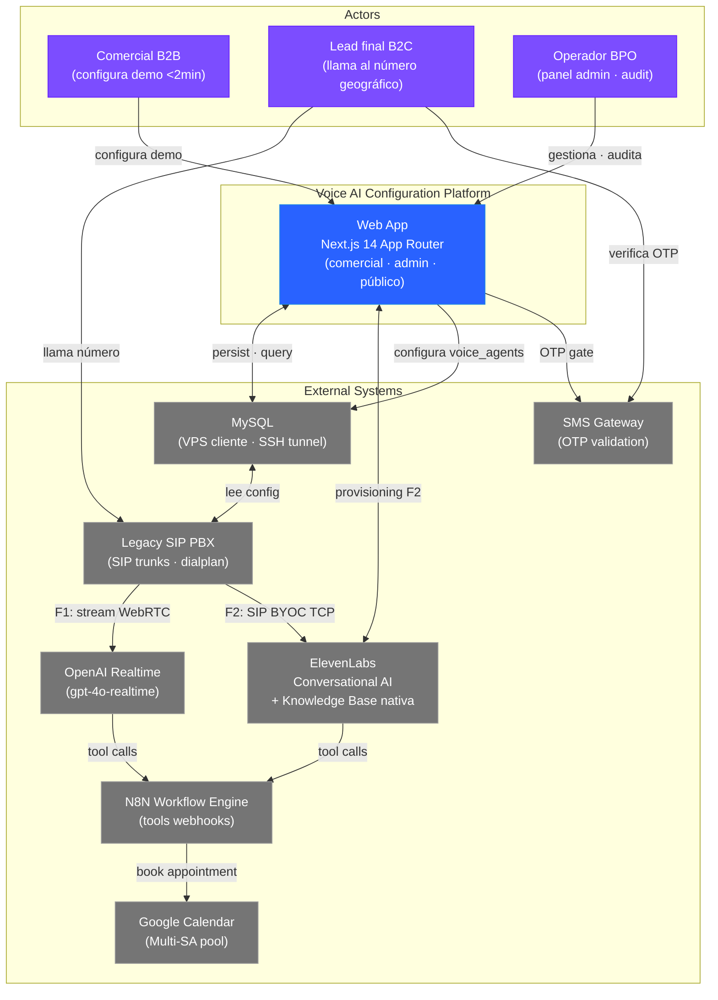
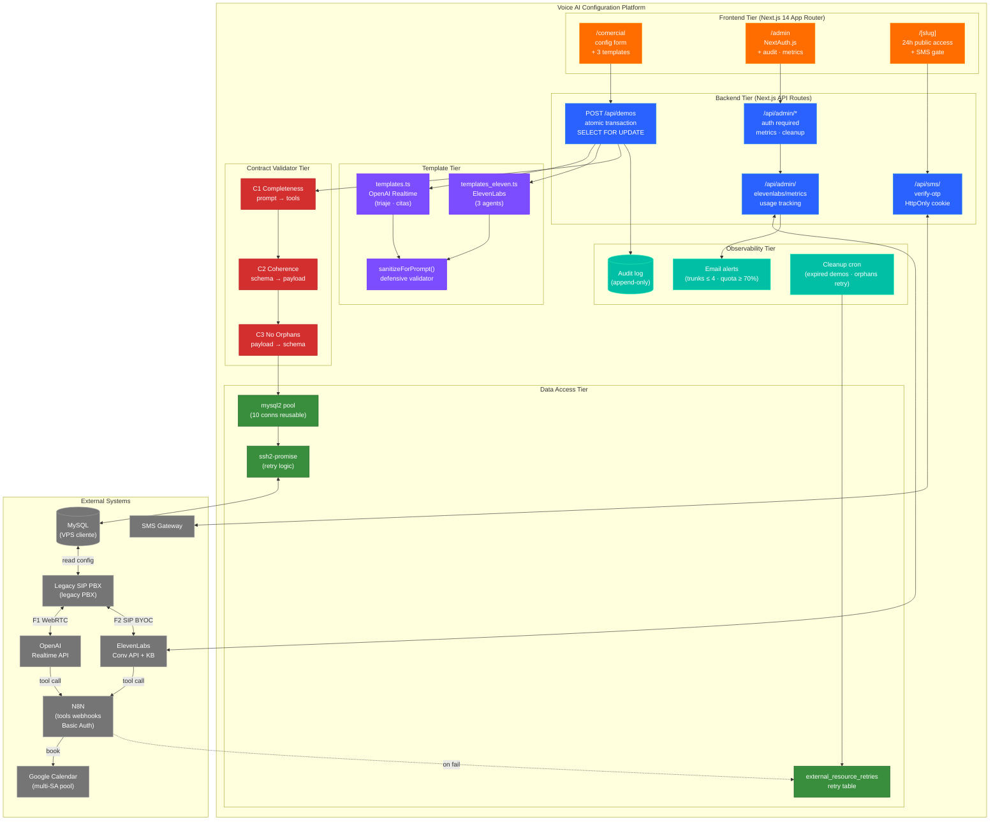
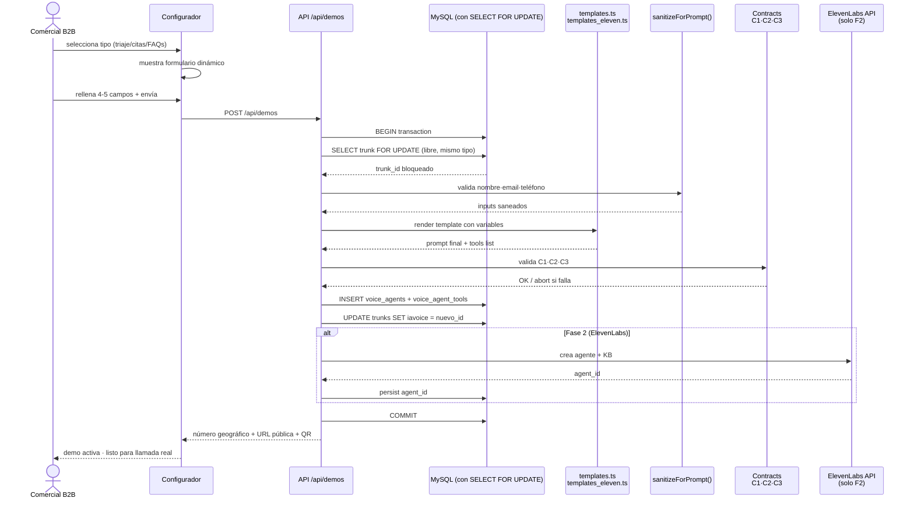
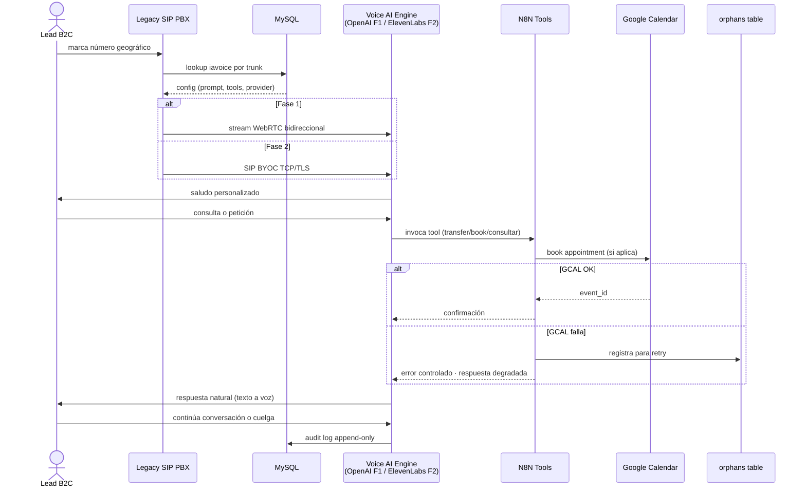

# Conversational Voice AI Platform — Case Study

**Engineered by [Kamil Slodki](https://www.linkedin.com/in/kamilslodki/)** · Valencia, España · Remote-first

**Plataforma SaaS multi-engine para configuración de agentes de voz IA conversacionales en menos de 2 minutos: comerciales B2B configuran demos personalizadas (triaje · citas · FAQs) que reciben llamadas reales de leads finales en número telefónico geográfico. Stack Next.js 14 + dos motores de voice AI conversacional coexistiendo (OpenAI Realtime gpt-4o-realtime via Legacy SIP PBX en producción + ElevenLabs Conversational AI eleven_flash_v2_5 con SIP BYOC en Fase 2) + telefonía SIP enterprise + N8N workflow engine para tools (transferencia, reserva en Google Calendar, consultas de catálogo) + Google Calendar multi-SA pool + validación SMS gate + MySQL multi-tenant en VPS con SSH tunnel. Entregado a operador BPO de contact center bajo NDA con disciplina institucional: 32 ADRs versionadas, 2 119 tests passing, validación de contratos prompt-tool-payload con 3 invariantes testables (C1/C2/C3), idempotencia transaccional con `SELECT FOR UPDATE`, defensas OWASP A5 (6 headers HTTP), reconciliación eventual con orphans table para integraciones externas no transaccionales, Fase 1 en producción 50+ días sin incidente con Fase 2 desarrollada en branch aislado sin tocar código vivo.**

Última actualización: 2026-05-18

<table>
<tr>
<td align="center" width="25%">VOICE AI EN PRODUCCIÓN <b>2 motores conversacionales</b> OpenAI Realtime (gpt-4o-realtime) F1 · ElevenLabs Conversational (eleven_flash_v2_5) F2 · SIP BYOC enterprise · multi-engine coexisting sin modificar PBX legacy</td>
<td align="center" width="25%">CONFIGURACIÓN ULTRA-RÁPIDA <b>&lt; 2 min comercial → demo activa</b> 3 templates dinámicos (triaje · citas · FAQs) · template estático renderizado en creación · prompt + tools + número geográfico listos para llamada real</td>
<td align="center" width="25%">DISCIPLINA INSTITUCIONAL <b>32 ADRs · 2 119 tests passing</b> contratos prompt-tool-payload validados (C1/C2/C3) · 20+ invariantes Fase 2 (INV-001 a INV-022) · cero incidentes producción 50+ días</td>
<td align="center" width="25%">INTEGRACIONES CRÍTICAS <b>5 sistemas externos coordinados</b> OpenAI · ElevenLabs · Legacy SIP PBX (PBX) · N8N (tools) · Google Calendar (multi-SA) · SMS gate · webhooks Basic Auth · orphans table para reconciliación eventual</td>
</tr>
</table>

> **Para founding / staff AI roles** — dos motores de voice AI conversacional coexistiendo en producción con SIP BYOC enterprise, contratos prompt-tool-payload validados como invariantes testables (C1/C2/C3), prompt rendering estático en creación para garantizar inmutabilidad y auditabilidad post-incidente, sanitización defensiva de datos de usuario en interpolación a LLM templates, validación de costos pre-ejecución contra cuotas de terceros (límite 5 min/trunk/día enforced, alerta 70 % mensual).
>
> **Para clientes B2B / fractional CTO** — case-study de delivery completo a operador BPO de contact center con clientes B2C: Fase 1 en producción 50+ días sin incidente, Fase 2 en branch aislado con 2 119 tests verdes y staging deployado vía Cloudflare Tunnel, multi-tenant sobre VPS heredado del cliente con SSH tunnel, 32 ADRs versionadas con plantilla fija, 6 headers HTTP de seguridad OWASP A5, 20+ invariantes Fase 2 documentadas antes de kickoff, sistema de branching (kamil_v2 + sub-ramas f2/*) que protege producción durante desarrollo paralelo.

---

## Sobre este case-study

Este repositorio describe una **plataforma de configuración de agentes de voz IA conversacionales para negocios B2B**, entregada a un operador BPO de contact center con clientes finales B2C en verticales de formación y servicios profesionales. La plataforma permite a comerciales B2B configurar una demo personalizada en menos de 2 minutos durante una reunión de venta con un prospect: el sistema le entrega al comercial **un número telefónico geográfico llamable** vinculado a un agente de voz IA personalizado con el catálogo, criterios de triaje y reglas de negocio del cliente final.

**Identidad del cliente BPO, nombres comerciales de los sub-clientes B2C, identificadores de telefonía, IPs de infraestructura, volúmenes absolutos del negocio y catálogo específico de productos no se mencionan** por consideraciones contractuales. La narrativa técnica aplica al patrón general "plataforma multi-tenant de voice AI configurable con tools dinámicos" — extrapolable a múltiples verticales (academia online · clínicas · seguros · servicios financieros · marketplaces de servicios · agencias inmobiliarias).

**Estado de las fases:**

- **Fase 1**: plataforma con OpenAI Realtime via Legacy SIP PBX — en producción 50+ días sin reseteo, sin incidente.
- **Fase 2**: introducción de ElevenLabs Conversational AI con SIP BYOC enterprise + 3 agentes especializados (triaje · citas · FAQs personalizados con Knowledge Base nativa) + unificación de flujo público 24 h + validación SMS gate — desarrollo completado en branch aislado, 2 119 tests verdes, staging deployado, pendiente kickoff de cliente.

---

## El problema

El cliente BPO operaba con un funnel comercial B2C dependiente de demos en vivo durante reuniones con prospects. El comercial necesitaba **enseñar al sub-cliente cómo funcionaría un agente IA con su negocio concreto**, en ese momento, durante esa reunión. Las soluciones del mercado fallaban sistémicamente:

| Antipatrón sistémico de la industria | Patrón aplicado en este proyecto |
|---|---|
| Demo genérica preconfigurada → no representa el caso real del prospect, baja conversión | **Configurador <2 min** con 3 templates (triaje · citas · FAQs) parametrizados con catálogo y reglas del prospect en vivo |
| Prompts editables en runtime → drift entre lo configurado y lo ejecutado, sin auditoría | **Template estático renderizado en creación** (ADR-S2-01) — el prompt se materializa con variables ya al crear la demo, inmutable durante toda la vida del agente |
| Asignación de recursos escasos sin control de concurrencia → dos comerciales reciben el mismo número | **`SELECT ... FOR UPDATE` en transacción atómica** (ADR-0002) — bloqueo de fila durante toda la secuencia de creación |
| Webhooks de tools (transferencia · reserva · consulta) sin autenticación → cualquier actor podría disparar acciones | **HTTP Basic Auth en dos niveles** (ADR-0006): plataforma de automatización + credenciales únicas por tool persistidas en `voice_agent_tools.webhook_user/pass` |
| Cambio de motor de voice AI requiere reescribir lógica de PBX → bloquea innovación, rompe producción | **SIP BYOC enterprise** (ADR-F2-03) — motores de voice AI conectados como trunks oficiales al PBX, sin modificar dialplan ni código legacy |
| Contrato implícito entre prompt y tools → el LLM menciona herramientas que no existen, o con parámetros que no llegan al webhook | **3 invariantes testables (C1/C2/C3)** — completitud (prompt → tools) · coherencia (schema JSON → payload placeholders) · sin huérfanos (payload → schema). Suite que bloquea merge si alguno falla |
| Datos de usuario interpolados sin validación en prompts → inyección de instrucciones, fugas de PII en LLM logs | **`sanitizeForPrompt()` defensiva** — validación de email · teléfono · nombre con longitud máxima y caracteres permitidos antes de interpolar en template |
| Integración con APIs externas (Calendar · SMS) tratada como transaccional → datos huérfanos cuando una falla | **Orphans table + cron retry** — fila local sin recurso externo se marca para reintento; cleanup que falla en remoto no falla el cleanup local |
| Gestión de cuotas de terceros (LLM · Voice AI) ignorada → corte abrupto cuando se agota el plan | **Límite de uso enforced por agente** (INV-017 Fase 2): 5 min/trunk/día · alerta proactiva al 70 % del plan mensual · pre-check antes de provisionar |

---

## La solución arquitectónica

Plataforma en **6 capas** con responsabilidades estrictamente separadas. Cada capa testeable, deployable y rolleable de forma aislada.

1. **Configurador comercial** (acceso sin login en `/comercial`): formulario dinámico de 4-5 campos según tipo de demo elegido (triaje · citas · FAQs). Outputs: prompt personalizado + lista de tools + número geográfico llamable.

2. **Asignación atómica de trunk** (concurrencia controlada): `BEGIN → SELECT ... FOR UPDATE → INSERT voice_agents → INSERT voice_agent_tools → UPDATE trunks.iavoice → COMMIT`. Garantiza exclusividad incluso con N comerciales simultáneos.

3. **Provisioning del agente IA**:
   - **Fase 1** (OpenAI Realtime): el motor de voice AI lee la configuración directamente de MySQL al recibir la llamada. Streaming bidireccional WebRTC.
   - **Fase 2** (ElevenLabs Conversational AI): provisioning vía API (creación de agente + Knowledge Base nativa para FAQs personalizados con RAG indexado multilingual_e5_large_instruct) + asignación del trunk SIP BYOC.

4. **Tools dinámicos vía workflow engine** (N8N): cada agente IA dispone de un set de tools según tipo (`transfer_call`, `book_appointment`, `check_calendar`, `consultar_catalogo`). Implementadas como webhooks N8N con Basic Auth. El LLM las invoca durante la llamada; los outputs vuelven al contexto conversacional en streaming.

5. **Integraciones críticas con sistemas externos**:
   - **Google Calendar Multi-SA pool**: cada demo de tipo "citas" usa una Service Account distinta para evitar compartición accidental entre clientes (ADR-0008 + ADR-0013).
   - **SMS gate** (Fase 2): validación OTP previa a acceder al agente público 24 h. Cookie HttpOnly server-side (SameSite=lax, 900 s) para evitar race con `router.push`.
   - **Legacy SIP PBX legacy** (Fase 1): preservado intacto. Fase 2 lo deja sin tocar gracias a SIP BYOC.

6. **Reconciliación eventual** (orphans table): cualquier integración externa no transaccional (Calendar · SMS · ElevenLabs API) que falle deja la fila local marcada para reintento por cron. El cleanup que falla en remoto no compromete el cleanup local.

---

## Arquitectura — notación C4

### Nivel 1 — Contexto

### Nivel 2 — Container

---

## Stack técnico

| Capa | Tecnología | Versión | Rol |
|---|---|---|---|
| **Frontend / Backend** | Next.js (App Router) | 14.2.5 | SaaS unificado · API Routes · Server Components |
| | React | 18.3.1 | UI |
| | TypeScript | 5.5.4 strict | Tipado completo · path aliases `@/*` |
| | Tailwind CSS | 3.4.10 | Styling utility-first |
| | NextAuth.js | 4.24.10 | Auth del panel admin |
| | Zod | 3.23.8 | Validación de payloads |
| **Voice AI Engines** | OpenAI Realtime | `gpt-4o-realtime` | Fase 1 producción · WebRTC bidireccional |
| | ElevenLabs Conversational AI | `eleven_flash_v2_5` | Fase 2 · SIP BYOC · KB nativa |
| **Telefonía** | Legacy SIP PBX (PBX) | Heredado | Fase 1 · trunks SIP · dialplan |
| | ElevenLabs SIP BYOC | TCP / TLS | Fase 2 · `SIP BYOC endpoint (TCP/TLS)` |
| **Workflow engine** | N8N | Self-hosted | Tools webhooks · Basic Auth |
| **Calendario** | Google Calendar API | v3 multi-SA pool | Reservas · pool de Service Accounts |
| **Mensajería** | SMS Gateway (cliente) | API REST | OTP gate · rate limit 3/h/IP |
| **Database** | MySQL | 5.7+ | Tablas `trunk_pool` · `voice_agents` · `voice_agent_tools` · `demos` · `external_resource_retries` |
| | mysql2 (Node) | 3.11.3 | Connection pooling (10 conns) |
| | ssh2-promise | 1.0.3 | Túnel SSH a VPS del cliente |
| **Testing** | Jest | 29.7.0 | **2 119 tests passing** · 80 suites |
| | @testing-library | latest | UI + concurrency + E2E |
| **CI/CD** | GitHub Actions | — | tsc · eslint · jest · pre-deploy smoke |
| | Cloudflare Tunnel | — | Staging seguro sin IP fija |
| **Hosting** | VPS cliente (nginx) | — | Producción · pm2 |

---

## Workflows principales

### Workflow A — Configuración de demo en menos de 2 minutos

### Workflow B — Llamada real del lead final

---

## Retos técnicos resueltos

### 1. Asignación atómica de recursos escasos bajo concurrencia

- **Síntoma**: dos comerciales creando demos simultáneamente recibían el mismo número telefónico. Sistema en estado inconsistente con dos agentes IA compartiendo un trunk.
- **Causa raíz**: la consulta "obtener trunk disponible" sin sincronización en BD no garantizaba exclusividad durante toda la secuencia de creación (insert agente · insert tools · update trunk).
- **Fix**: transacciones explícitas con `SELECT ... FOR UPDATE` en MySQL. La fila del trunk se bloquea durante toda la transacción. Encapsulación en función atómica: `BEGIN → SELECT FOR UPDATE → INSERT voice_agents → INSERT voice_agent_tools → UPDATE trunks → COMMIT`. Test de concurrencia bajo carga en `e2e-matrix.test.ts`.
- **Lección**: en sistemas multi-usuario que reasignan recursos escasos, la atomicidad transaccional con locks pesimistas bien dimensionados es más simple y robusta que locks optimistas con reintentos en cliente. Mientras el set de recursos sea ≤ ~100, el coste de contención es aceptable.

### 2. Webhooks de tools sin autenticación

- **Síntoma**: cualquier actor en Internet podía invocar los webhooks de tools del agente (transferencia de llamada · reserva · consulta de catálogo) conociendo la URL. Riesgo de disparar acciones críticas sin autorización.
- **Causa raíz**: el workflow engine (N8N) aceptaba POST sin verificar identidad. El sistema confiaba en que solo el motor de voice AI llamaría a esos endpoints.
- **Fix**: HTTP Basic Auth en dos niveles. (1) Plataforma de automatización: activar Basic Auth en el trigger del webhook. (2) App: generar credenciales únicas por tool en `voice_agent_tools.webhook_user` / `webhook_pass`, incluirlas en cada invocación. Módulo centralizado `toolAuth.ts` valida antes de procesar.
- **Lección**: los webhooks que actúan sobre recursos críticos requieren autenticación fuerte aunque estén detrás de una "API interna". Próximo refinamiento: HMAC con timestamp para proteger contra replay attacks.

### 3. Contrato implícito entre prompt LLM y tools (3 invariantes testables)

- **Síntoma**: el agente IA mencionaba en el prompt "usa la herramienta consulta_X para verificar Y". Sin embargo, el schema JSON de la tool requería parámetros que no eran conocidos en ese paso del flujo, o el webhook esperaba placeholders no incluidos en el `parameters.properties`. Resultado: el LLM proporcionaba valores que nunca llegaban al workflow.
- **Causa raíz**: el diseño de prompts, schemas y payloads de webhooks se hacía de forma desacoplada, sin verificación cruzada. No había "contrato" formal entre las tres piezas.
- **Fix**: tres invariantes validadas por test automatizado antes de cada merge (ADR-S2-04):
  - **C1 Completitud**: toda herramienta mencionada en el prompt debe existir en la lista de tools generada.
  - **C2 Coherencia**: los parámetros `required` del schema JSON deben ser subset de los placeholders reales del webhook payload.
  - **C3 Sin huérfanos**: no pueden existir placeholders en el payload que no estén definidos en `parameters.properties` del schema.
- **Lección**: los LLMs son "compiladores débiles" — un prompt sintácticamente correcto puede tener semántica rota. Los contratos entre prompt y tools deben formalizarse como invariantes testables que bloqueen merge si fallan, no confianza humana.

### 4. PII y tokens API expuestos en almacenamiento

- **Síntoma**: auditoría de seguridad detectó (1) API keys de OpenAI (`sk-...`, 167 caracteres) en texto plano en columna `voice_agents.token` (2) DNIs e emails de usuarios interpolados directamente en prompts del sistema sin sanitización ni control de longitud.
- **Causa raíz**: diseño inicial priorizó funcionalidad. Las claves se persistían en BD para que el PBX las leyera directamente. Los datos personales se interpolaban como strings crudos.
- **Fix**: (1) API keys migradas a variable de entorno `OPENAI_API_KEY` en el servidor (la app la lee del env, no de BD). (2) Datos personales pasan por `sanitizeForPrompt()` defensiva: valida formato (email · teléfono · nombre) · longitud máxima · caracteres permitidos · escapado de caracteres especiales antes de interpolar en template.
- **Lección**: los datos sensibles no deben persistirse en la forma en que se usarán. La interpolación de input de usuario en LLM prompts requiere validación/sanitización estricta para evitar inyecciones y minimizar superficie de exposición en logs de terceros.

### 5. Headers HTTP de seguridad faltantes (OWASP A5)

- **Síntoma**: auditoría OWASP identificó ausencia total de headers de seguridad. La SPA era vulnerable a (1) clickjacking via iframe en sitio malicioso (2) MITM sin HSTS si alguna vez se accedía vía HTTP (3) XSS sin CSP.
- **Causa raíz**: configuración por defecto de Next.js sin el bloque `headers()` en `next.config.js`. Los valores por defecto son vacíos — no hay protección de fábrica.
- **Fix**: bloque `headers()` centralizado en config que aplica a todas las rutas:
  - `X-Frame-Options: DENY` (anti-clickjacking)
  - `Content-Security-Policy: frame-ancestors 'none'` (refuerzo CSP)
  - `Strict-Transport-Security: max-age=31536000` (HSTS 1 año)
  - `X-Content-Type-Options: nosniff`
  - `Referrer-Policy: strict-origin-when-cross-origin`
  - `Permissions-Policy` con lista cerrada
- **Lección**: los headers HTTP son una línea de defensa barata y efectiva. Deben aplicarse de forma centralizada (no por ruta) y desde el primer deploy. Cualquier auditoría contra OWASP A5 (control de acceso roto) debe verificarlos.

### 6. Reconciliación entre Google Calendar y BD local (orphans table)

- **Síntoma**: al crear una demo de "citas", la app insertaba la fila local y luego intentaba crear el calendario en Google. Si la llamada a Calendar fallaba **después** del insert local, la fila quedaba con `calendar_id` apuntando a un recurso inexistente. Al expirar la demo, el cleanup intentaba borrar el calendario remoto y fallaba, dejando registros huérfanos.
- **Causa raíz**: transacciones distribuidas — la app no puede garantizar ACID entre MySQL local y una API REST externa (Google). Cualquier fallo transitorio en remoto rompe la consistencia.
- **Fix**: patrón "orphans table + cron retry" formalizado:
  - **Creación**: INSERT `demos` SIN `calendar_id`. Crear calendario en Google. Si OK, UPDATE `calendar_id`. Si falla, dejar fila con `calendar_id=NULL` e insertar entrada en `external_resource_retries`.
  - **Cleanup**: intentar DELETE en Google. Si falla (404 ya borrado, 500 timeout), no fallar el cleanup local — registrar en `external_resource_retries` para que cron reintente más tarde con backoff.
- **Lección**: los sistemas distribuidos no garantizan ACID sin coordinación explícita. El patrón "orphans table + cron retry con backoff" es la solución estándar para tolerar fallos transitorios en integraciones externas sin corromper el estado local. Aplicable a cualquier API externa no transaccional (Calendar · SMS · CRM · gateway de pago).

---

## Decisiones arquitectónicas seleccionadas

### ADR-0002 — Atomic trunk assignment via `SELECT FOR UPDATE`

- **Decisión**: usar lock a nivel BD (`SELECT ... FOR UPDATE`) dentro de transacción explícita para prevenir asignación duplicada cuando múltiples comerciales compiten por el mismo set de recursos escasos.
- **Alternativas evaluadas**: optimistic locking con version field · Redis-based distributed locks · application-level mutex · unique constraints como complemento.
- **Por qué importa**: demuestra disciplina de concurrencia sin dependencias externas. Trade-off de potencial contención de fila (aceptable a ~40 recursos concurrentes) por garantías de consistencia fuerte.

### ADR-0005 — API key hardening (MVP env vars → post-MVP encrypted at rest)

- **Decisión**: en MVP, almacenar credenciales (API keys) en variables de entorno inyectadas en deploy. Post-MVP: cifrar at rest en DB o migrar a secret manager externo tras coordinación con sistemas upstream.
- **Alternativas evaluadas**: env vars (seleccionado MVP) · AES-256 at-rest (bloqueado por upstream) · external secret manager (Vault / AWS Secrets Manager — requiere integración upstream).
- **Por qué importa**: ilustra capas de seguridad pragmáticas. Reducción de superficie de ataque sin requerir upgrades de infra que desestabilizarían producción. Separa explícitamente constraints de MVP de obligaciones de hardening a largo plazo con plan de rollout documentado.

### ADR-0013 — Quota management de APIs de terceros (request first, pool second)

- **Decisión**: solicitar primero ampliación de cuota al proveedor (zero-code, dependiente de aprobación). Implementar pooling dinámico de Service Accounts con failover solo si la ampliación se deniega o la concurrencia supera 100+ recursos simultáneos.
- **Alternativas evaluadas**: request quota increase (selección por defecto · opción A) · pool con failover (opción B diferida) · calendario compartido (descartado — causa colisiones de scheduling).
- **Por qué importa**: separación clara entre escalado operativo y complejidad arquitectónica. Default al camino más simple documentando el fallback. Trade-off explícito: zero-code vs. dependencia operativa.

### ADR-S2-01 — Template estático renderizado en creación, no en runtime

- **Decisión**: renderizar el prompt del agente IA con variables al crear la demo (substitute once), persistir el prompt ya renderizado. NO re-renderizar en cada sesión ni permitir updates dinámicos post-creación.
- **Alternativas evaluadas**: static render at creation (seleccionado) · template con placeholders persistidos resueltos per-call en runtime · prompt completamente estático sin personalización.
- **Por qué importa**: resuelve trade-off fundamental en sistemas con LLM. El render estático provee auditabilidad (el prompt exacto visible en logs para compliance), simplicidad (sistemas upstream no necesitan lógica de resolución de templates) y previene drift entre creación y ejecución. Sacrifica mutabilidad pero garantiza reproducibilidad e incident analysis fiable.

### ADR-F2-03 — SIP BYOC architecture: multi-engine coexistence sin modificar PBX

- **Decisión**: usar SIP trunking oficial (BYOC — Bring Your Own Carrier) para delegar el motor de voice AI completamente al proveedor (ElevenLabs). El PBX legacy actúa como gateway puro (dialplan routing), no como host de lógica AI. Fase 1 (OpenAI) permanece intacta para estabilidad de producción.
- **Alternativas evaluadas**: modificar schema y código del PBX para soportar el nuevo motor nativamente (rechazado — 1-2 semanas, riesgo producción) · pooling dinámico de trunks con switching runtime · números separados via carrier nuevo (rechazado — coste e integración extra) · proxy SIP intermedio (fallback si PBX no soporta TLS).
- **Por qué importa**: demuestra cómo escalar sistemas heterogéneos sin tocar infraestructura legacy. Insight central: usar integraciones oficiales (SIP trunking) en vez de parchear sistemas upstream, aunque añada saltos. Coexistencia explícita de dos generaciones de producción (F1 estable · F2 isolada en pool reservado). Reversibilidad garantizada — si el piloto falla, revert sin tocar código F1.

---

## Estado y madurez técnica

- **Fase 1 en producción**: 50+ días sin reseteo · sin incidente · OpenAI Realtime via Legacy SIP PBX heredado del cliente.
- **Fase 2 en staging completado**: branch aislado (`kamil_v2` + sub-ramas `f2/*`) con ElevenLabs Conversational AI + SIP BYOC + 3 agentes especializados + Knowledge Base nativa + SMS gate. Pendiente kickoff de cliente.
- **32 ADRs versionadas** con plantilla fija (contexto · decisión · alternativas evaluadas · consecuencias · plan rollout · plan rollback).
- **2 119 tests passing** · 80 test suites Jest · 0 skipped · cobertura UI + concurrencia + E2E + contract validators.
- **20+ invariantes Fase 2** documentadas antes de kickoff (INV-001 a INV-022) — desde anti-prompt-injection hasta gestión de cuotas, validación de KB, multi-engine coexistence.
- **5 integraciones externas** estables: OpenAI · ElevenLabs · Legacy SIP PBX · N8N · Google Calendar · SMS.
- **3 generadores dinámicos de prompts** (`templates.ts` F1 + `templates_eleven.ts` F2) con 3 000+ líneas combinadas.
- **TypeScript strict mode** · ESLint enforced · CI gates: `tsc --noEmit` + `eslint` + `jest 29.7` + pre-deploy smoke tests.

---

## Compliance y seguridad

- **GDPR**: PII de leads (nombre · teléfono · DNI cuando aplica triaje) sanitizada con `sanitizeForPrompt()` antes de interpolación. Audit log append-only en `demos` y `voice_agents`. Cleanup de demos expiradas via cron — expira en 7 días (comercial) o 1 día (acceso web público).
- **OWASP A5 (Broken Access Control)**: 6 headers HTTP de seguridad aplicados centralmente (X-Frame-Options · CSP frame-ancestors · HSTS · X-Content-Type-Options · Referrer-Policy · Permissions-Policy).
- **API keys**: migradas de DB a env vars del servidor (ADR-0005). Plan documentado de migración a secret manager externo post-MVP.
- **Webhooks**: HTTP Basic Auth en dos niveles (workflow engine + credenciales por tool en DB). Próximo refinamiento: HMAC con timestamp.
- **SMS gate (Fase 2)**: rate limit anti-spam 3 intentos/hora/IP. Cookie HttpOnly server-side con SameSite=lax y TTL 900 s para evitar race con `router.push`.
- **Multi-tenant en SaaS pool**: cada demo de "citas" usa Service Account distinta (ADR-0008) para Google Calendar — previene compartición accidental entre clientes finales del cliente BPO.
- **Quota tracking ElevenLabs**: límite 5 min/trunk/día enforced (INV-017) · alerta al 70 % del plan mensual · pre-check antes de provisionar.

---

## Escala y operación

- **Concurrencia trunk pool**: dimensionada para ~40 recursos disponibles por tipo (triaje · citas). Lock contention aceptable a ese rango. Plan documentado para escalado vertical.
- **Connection pool MySQL**: 10 conexiones reutilizables vía mysql2. SSH tunnel persistente con retry logic en `ssh2-promise`.
- **Hosting**: VPS heredado del cliente (nginx + pm2). Sin dependencia de cloud provider del lado de la app — todo se opera sobre la infra del cliente.
- **Staging**: Cloudflare Tunnel sin IP fija (`*.trycloudflare.com`) para desarrollo seguro y demos pre-kickoff.
- **Cleanup automation**: cron job idempotente · `DELETE voice_agent_tools` → `DELETE voice_agents` → `UPDATE trunks SET iavoice = NULL`. Sentinel en `demos.activa = 0`. Alerta email si trunks disponibles ≤ 4 por tipo.
- **Métricas exportadas**: endpoint `/api/admin/elevenlabs/metrics` (Fase 2) con duración provisioning <30s como KPI + tracking de uso vs cuota mensual.
- **Audit log append-only**: cada creación, modificación, expiración y cleanup queda registrado para post-mortem y compliance.

---

## Donde se aplica este patrón

El patrón "plataforma multi-tenant de voice AI configurable con tools dinámicos · multi-engine coexistence · contratos prompt-tool-payload formales · reconciliación eventual con orphans table" es **horizontal a múltiples verticales B2B con funnel B2C**:

- Operadores BPO de contact center con sub-clientes verticales (sectores formación · clínicas · servicios financieros).
- Marketplaces de servicios con captación telefónica.
- Academias y centros de formación con captación inbound.
- Clínicas y centros de salud digital con triaje pre-cita.
- Inmobiliarias con cualificación de prospects.
- Aseguradoras con triaje de siniestros.
- Recruiting con primera entrevista automatizada.

Los retos técnicos resueltos (concurrencia transaccional · webhooks autenticados · contratos prompt-tool-payload · sanitización de PII en LLM · headers OWASP · reconciliación con orphans table · multi-engine SIP BYOC · quota management proactivo) son **horizontales a cualquier sistema voice AI conversacional en producción real**.

---

## Sistema operativo de ingeniería del autor

Este proyecto se desarrolló bajo el sistema operativo de ingeniería propio del autor, replicado cross-proyecto en 13+ proyectos del ecosistema:

- **Automation Engineering Protocol** — stage-gate horizontal de cambio: change-spec → guard layer → release train → rollback playbook.
- **Prompt Engineering Protocol** — diseño modular: required/optional/exclusion keywords + patterns regex + confidence scoring + anti-echo + whitelist + schema JSON validation + contratos formales prompt-tool-payload (C1/C2/C3).
- **Post-Development Verification Protocol** — 4 niveles (estática / integración / canarios E2E con datos sintéticos / observabilidad diaria).
- **Post-Development Gates** — 94 gates pre-merge / pre-deploy / post-deploy con checklist bloqueante.
- **Frozen Zones & Regression Prevention** — CONFIG vs HEALTH, auditoría holística periódica.

Cada decisión estructural se documenta como ADR versionada. Cada cambio significativo pasa por `verify-findings` adversarial. Engineering-playbook propio con **60+ archivos doctrinales cross-proyecto**. La documentación es activo de primera clase.

Protocolo de documentación detallado (arc42 + C4 + ADR + runbooks + postmortems) en [`docs/documentation-protocol.md`](docs/documentation-protocol.md).

*Detalles operativos del playbook y del entregable original bajo acuerdo de confidencialidad.*

---

## Contacto

**Kamil Slodki** — Valencia, España

- Email: `solutions.satdata@gmail.com`
- LinkedIn: [Kamil Slodki](https://www.linkedin.com/in/kamilslodki/)
- Portfolio: [satdata-portfolio](https://github.com/KamilSlodki/satdata-portfolio)

Disponible para **founding / staff AI roles** (remote · full-time + equity) y **B2B consulting / fractional CTO engagements** (retainer · day-rate · proyectos cerrados). Para consultas técnicas concretas, briefings de proyecto o detalles de compensación, escribir directamente al email comercial.
